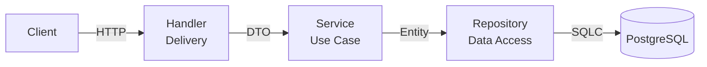

# Go Starter

## Clean Architecture



## Layer Responsibilities

| Layer          | Responsibility                                     | Depends On             |
| -------------- | -------------------------------------------------- | ---------------------- |
| **Handler**    | Parse HTTP requests, call service, return response | service, dto, response |
| **Service**    | Business logic, validation, orchestration          | repository, entity     |
| **Repository** | Data access only (no business logic)               | database, entity       |
| **Entity**     | Pure domain/business structs                       | nothing                |
| **DTO**        | API request/response shapes                        | nothing                |

## Stack

- **Go 1.25+** — language
- **Chi** — HTTP router
- **PostgreSQL** — database
- **Resend** — transactional email (OTP)
- **PayPal** — subscription billing
- **Swagger** — API documentation
- **golang-jwt** — JWT authentication
- **validator/v10** — request validation

## Features

- OTP-based email verification & registration
- JWT authentication (login, protected routes)
- User profile & billing info
- PayPal subscription (create, cancel, webhook)
- Rate limiting per route group
- Swagger/OpenAPI docs at `/api/v1/swagger/`
- Clean architecture (handler → service → repository → entity)

## Project Structure

```
cmd/
└── api/
    └── main.go                 # Composition root
internal/
├── entity/                     # Domain entities & errors
│   ├── user.go
│   ├── otp.go
│   └── errors.go
├── dto/
│   ├── request/                # Request DTOs
│   │   ├── auth.go
│   │   └── billing.go
│   └── response/               # Response DTOs
│       ├── auth.go
│       ├── user.go
│       └── billing.go
├── repository/                 # Data access (PostgreSQL)
│   ├── user_repository.go
│   ├── otp_repository.go
│   └── billing_repository.go
├── service/                    # Business logic
│   ├── auth_service.go
│   ├── user_service.go
│   └── billing_service.go
├── handler/                    # HTTP handlers
│   ├── auth_handler.go
│   ├── user_handler.go
│   └── billing_handler.go
├── middleware/                 # HTTP middleware
│   ├── auth.go
│   ├── cors.go
│   └── ratelimit.go
├── router/                     # Route definitions
│   └── router.go
├── helpers/                    # Shared utilities
│   ├── json.go
│   ├── context.go
│   └── validator.go
├── database/                   # DB connection
│   └── postgres.go
├── mailer/                     # Email service
│   └── resend.go
└── paypal/                     # PayPal client
    └── client.go
```

## Getting Started

### Prerequisites

- Go 1.25+
- PostgreSQL 16+
- Docker & Docker Compose
- [`migrate`](https://github.com/golang-migrate/migrate) CLI
- [`swag`](https://github.com/swaggo/swag) CLI (for docs generation)

### Setup

**1. Clone and rename the project**

```bash
git clone https://github.com/farrasnazhif/go-starter.git my-project
cd my-project
```

**2. Replace module name**

Replace `github.com/yourname/my-project` with your actual module path.

```bash
OLD_MODULE="github.com/farrasnazhif/go-starter"
NEW_MODULE="github.com/yourname/my-project"
```

macOS:
```bash
find . -type f -name "*.go" -exec sed -i '' "s|$OLD_MODULE|$NEW_MODULE|g" {} +
sed -i '' "s|$OLD_MODULE|$NEW_MODULE|g" go.mod
```

Linux:
```bash
find . -type f -name "*.go" -exec sed -i "s|$OLD_MODULE|$NEW_MODULE|g" {} +
sed -i "s|$OLD_MODULE|$NEW_MODULE|g" go.mod
```

**3. (Optional) Rename the database**

Edit `POSTGRES_DB` in `docker-compose.yml` to your project name.

**4. Copy environment config**

```bash
cp .envrc.example .envrc
# Edit .envrc with your values
direnv allow .
```

**5. Start PostgreSQL**

```bash
docker compose up -d
```

**6. Run migrations**

```bash
make migrate-up
```

**7. Run the server**

```bash
go run cmd/api/main.go
```

Or with hot reload:
```bash
air
```

API runs on `http://localhost:8080`  
Swagger UI at `http://localhost:8080/api/v1/swagger/`

## Current API Endpoints

| Method | Endpoint                               | Auth | Description           |
| ------ | -------------------------------------- | ---- | --------------------- |
| GET    | `/api/v1/health`                       | —    | Health check          |
| POST   | `/api/v1/auth/register`                | —    | Register user         |
| POST   | `/api/v1/auth/otp/send`                | —    | Send OTP              |
| POST   | `/api/v1/auth/otp/verify`              | —    | Verify OTP & activate |
| POST   | `/api/v1/auth/login`                   | —    | Login                 |
| GET    | `/api/v1/users/me`                     | ✓    | Get profile           |
| GET    | `/api/v1/users/billing`                | ✓    | Get billing info      |
| POST   | `/api/v1/billing/paypal/subscriptions` | ✓    | Create subscription   |
| DELETE | `/api/v1/billing/paypal/subscriptions` | ✓    | Cancel subscription   |
| POST   | `/api/v1/billing/paypal/webhook`       | —    | PayPal webhook        |
| GET    | `/api/v1/swagger/*`                    | —    | API docs              |

## Make Commands

```bash
make test              # Run tests
make migration NAME    # Create migration
make migrate-up        # Run migrations
make migrate-down      # Rollback migrations
make gen-docs          # Generate Swagger docs
make seed              # Seed database
```

## Environment Variables

See [`.envrc.example`](.envrc.example) for all available variables.
